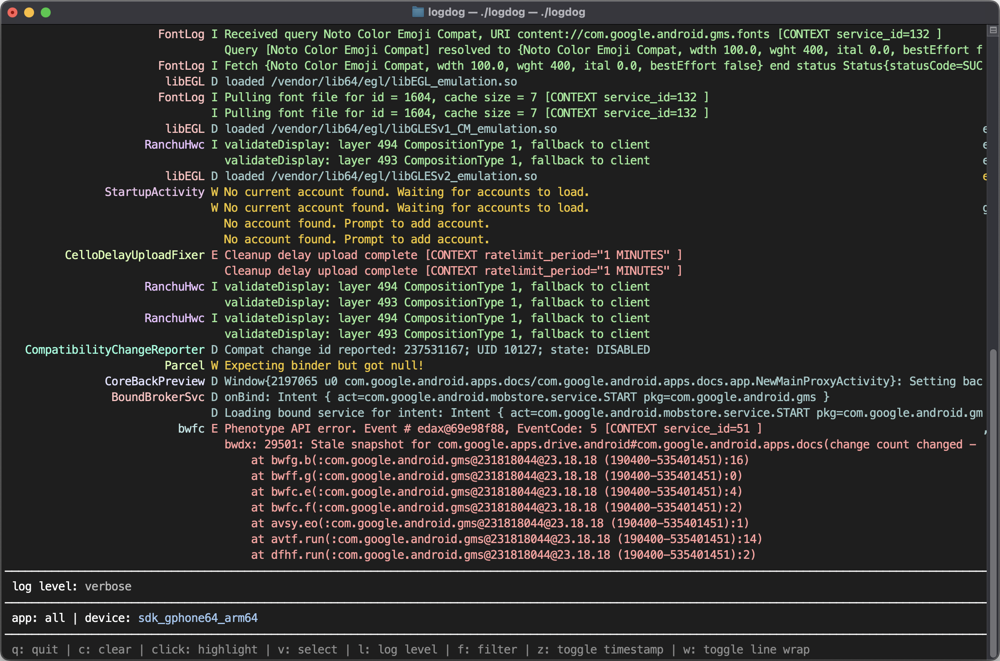

# Logdog

A text-based interface for viewing and filtering Android logcat stream.



## Features

- Filter logs by application ID
- Automatically reconnects when app restarts with new PID
- Filter logs by tags or message contents
- Filter logs by log level
- Highlight any log entry by clicking it and navigate with up/down
- Select and copy log content
- Toggleable line wrapping
- Pretty colors

## Installation

### Homebrew (macOS)

```bash
brew install mikaelreiersolmoen/homebrew-tap/logdog
```

### Install with Go

```bash
go install github.com/mikaelreiersolmoen/logdog@latest
```

### Build from source

```bash
git clone https://github.com/mikaelreiersolmoen/logdog.git
cd logdog
make build
```

## Usage

```bash
# View logs for all applications
logdog

# View logs for one application
logdog --app com.example.app

# View logs with custom tail size (default is 1000)
logdog --tail 5000

# View no prior logs (only new entries)
logdog --tail 0

# View _all_ logs
logdog --tail all

# Using shorthand flags
logdog -a com.example.app -t 2000
```

### Prerequisites

- Android Debug Bridge (ADB) must be installed and in your PATH
- An Android device connected or an emulator running

### Filtering

Filters are defined in a single input, separated by comma. To filter on tags, use a tag prefix like so: `tag:MyTag`. Filters without the tag prefix are applied to the log message. With filters applied, log entries are shown if they match _any_ of the tag filters, and _all_ of the message filters. Filters are treated as regular expressions (Go RE2 syntax). Use `\` to escape and include comma (`,`) in a filter.

### Highlighting

Click on a log entry to highlight it and move the highlight with `up`/`down` or `j`/`k`.

### Selection mode

`v` to enter selection mode, `up`/`down`, `j`/`k` or mouse click to select multiple lines. `c` to copy entire log, `C` to copy log message only (useful for copying stack traces).

### Configuration

Settings are stored in `~/.config/logdog/config.json`:

- Selected log level
- Filters
- Timestamp toggle
- Line wrap toggle
- Tag column width

## Built with

- [Bubble Tea](https://github.com/charmbracelet/bubbletea) - TUI framework
- [Bubbles](https://github.com/charmbracelet/bubbles) - UI components (viewport)
- [Lipgloss](https://github.com/charmbracelet/lipgloss) - Styling and layout

## License

MIT
